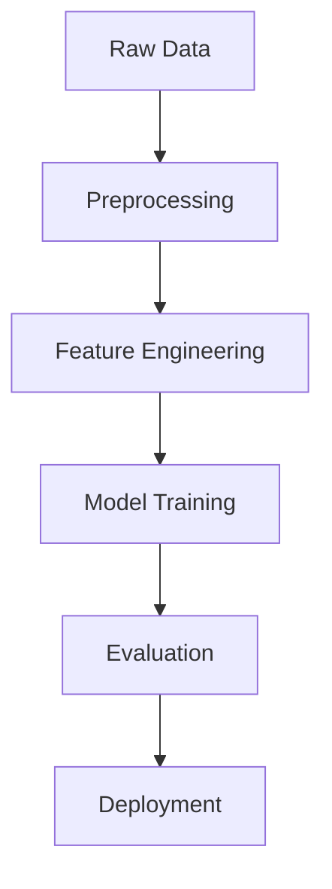

## **Project Title:** 🏏 *CIPS - Cricket IPL Prediction System*

### 🧠 Overview
IPL Win Predictor is a machine learning application that predicts the probability of winning for IPL teams based on current match conditions. Predicts the final outcome after second innings in a limited-overs cricket match based on real-time match conditions such as current score, overs left, wickets in hand, and team statistics.

Our goal:
**To predict the final outcome and probability** based on current match context using regression models.


---

### ✅ Skills & Tools Applied

| Category          | Tools/Tech Stack                          |
| ----------------- | ----------------------------------------- |
| Language          | Python                                    |
| ML Models         | Linear Regression, Random Forest, XGBoost |
| Libraries         | Pandas, NumPy, Scikit-learn, XGBoost      |
| Visualization     | Matplotlib, Seaborn                       |
| Logging           | Python Logging                            |
| Deployment        | Flask, HTML, CSS, Render                  |
| Code Quality      | Modular Code, Logging                     |
| CI/CD             | GitHub Actions                            |
| Containerization  | Docker                                    |

---

### 📂 Project Structure

```
CIPS/
│
├── .github/
│   └── workflows/
│       └── ci.yml
| 
├── data/                   # Raw and processed datasets
├── notebook/
│   └── experiment.ipynb  
|             
├── src/
│   ├── data_collection.py
│   ├── model_evaluation.py
│   └── preprocessing.py
|
├── utils/
│   └── eda.py
│
├── static/
│   └── style.css   
│
├── templats/
│   └── index.html
|
├── test/
│   └── test_app.py
|
├── model/
│   └── pipe.pkl
|
├── setup.py 
├── render.yaml 
├── app.png
├── .gitignore                     
├── Dockerfile
├── requirements.txt
├── LICENSE
├── main.py                 
└── README.md
```

---

### 📂 Dataset
IPL Match Data (2008-2020) containing:
- 800+ matches
- 10+ features including:
  - Batting/Bowling teams
  - Current score
  - Wickets fallen
  - Overs completed
  - Venue information

Dataset available at: [Kaggle IPL Dataset](https://www.kaggle.com/datasets/patrickb1912/ipl-complete-dataset-20082020)

---

### 🤖 Model Architecture


---

### ⚙️ Model Pipeline

* **Preprocessing**: Missing value handling, team encoding, outlier removal
* **Feature Engineering**: Run rate, wicket pressure, encoded teams, etc.
* **Modeling**:
  * `LogesticRegression` ✅ best performance

---

### 🔧 Logging & Modularity

✅ Custom `logger.py` implemented using `Python logging` for modular monitoring of each stage:

* Data loading
* Preprocessing
* Model training
* Evaluation

✅ All components in `src/` are modularized and reusable.

---

### 📦 Deployment Ready

* Flast with HTML and CSS for real-time input & prediction
* Deploy on render of live preview.

---

### 🔁 Future Improvements

* 🧠 LSTM or Temporal models for over-by-over dynamic prediction
* 📡 Live match data stream integration
* 📊 Visualization dashboard using Dash or Streamlit
* 🎯 Hyperparameter tuning with Optuna

---

### 👤 Author

**Md Emon Hasan**
🎓 Computer Science & Engineering
📧 [iconicemon01@gmail.com](mailto:iconicemon01@gmail.com)
🔗 [LinkedIn](https://www.linkedin.com/in/md-emon-hasan-695483237/) | [GitHub](https://github.com/Md-Emon-Hasan)

---