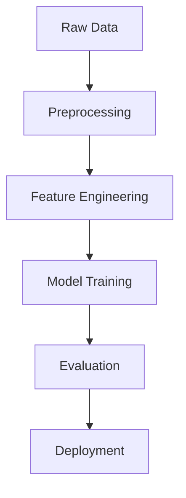

# CIPS - Cricket IPL Prediction System

[](https://opensource.org/licenses/MIT) [](https://www.python.org/downloads/) [](https://fastapi.tiangolo.com/) [](https://reactjs.org/) [](https://vitejs.dev/) [](https://tailwindcss.com/) [](https://www.docker.com/) [](https://www.sqlite.org/) [](https://scikit-learn.org/) [](https://pandas.pydata.org/) [](https://xgboost.ai/) [](https://beta.ruff.rs/docs/) [](http://mypy-lang.org/) [](https://docs.pytest.org/)

IPL Win Predictor is a machine learning application that predicts the probability of winning for IPL teams based on current match conditions. Predicts the final outcome after second innings in a limited-overs cricket match based on real-time match conditions such as current score, overs left, wickets in hand, and team statistics.

Our goal:
**To predict the final outcome and probability** based on current match context using regression models.

[](https://github.com/user-attachments/assets/f5a8305e-a504-4148-865d-e6ff3bf21784)


---

## Project Structure

```text
CIPS/
├── .github/                      # CI/CD Workflows
│   └── workflows/
│       └── main.yml
│             
├── backend/                      
│   ├── app/                      # Application Package
│   │   ├── __init__.py
│   │   ├── main.py               # FastAPI Entry Point
│   │   ├── db.py                 # Database Configuration
│   │   ├── models.py             # Data Models (Pydantic & SQLModel)
│   │   ├── api/                  # API Layer
│   │   │   ├── __init__.py
│   │   │   └── endpoints.py      # predict endpoint with logic & logging
│   │   ├── core/                 # Core Infrastructure
│   │   │   ├── __init__.py
│   │   │   ├── config.py         # App Settings & Environment Variables
│   │   │   └── logging_config.py # Structured Logging System
│   │   ├── ml_model/             # Machine Learning Artifacts
│   │   │   └── pipe.pkl          # Serialized ML Pipeline
│   │   ├── services/             # Background & ML Services
│   │   │   ├── __init__.py
│   │   │   ├── data_collection.py # Dataset fetching & loading
│   │   │   ├── model_evaluation.py # Model training & metric reporting
│   │   │   └── preprocessing.py   # Complex data transformation pipelines
│   │   └── utils/                # Utility Functions
│   │       ├── __init__.py
│   │       └── eda.py            # Exploratory Data Analysis & Visualization
│   ├── data/                     # Data Storage
│   │   ├── cips.db               # SQLite Database for Prediction History
│   │   ├── deliveries.csv        # Historical Ball-by-Ball Data
│   │   └── matches.csv           # Historical Match Summaries
│   ├── logs/                     # Application Logs
│   │   └── app.log               
│   ├── notebook/                 # Research & Development
│   │   └── experiment.ipynb      
│   ├── tests/                    # Backend Testing Suite
│   │   ├── __init__.py
│   │   ├── test_api.py           # API Integration Tests
│   │   ├── test_db.py            # Database Logic Tests
│   │   ├── test_endpoints_fail.py # ML Failure Scenario Tests
│   │   ├── test_services.py      # Preprocessing & Service Logic Tests
│   │   └── test_utils.py         # EDA Utility Tests
│   ├── Dockerfile                # Dockerfile
│   ├── pyproject.toml            # Python Tooling Config
│   ├── requirements.txt          # Dependencies
│   └── setup.py                  # Package Metadata
│
├── frontend/                     # Frontend Root (Vite + React)
│   ├── src/
│   │   ├── components/           # Reusable UI components
│   │   │   ├── Footer.jsx
│   │   │   └── PredictionForm.jsx # Main Prediction Interface
│   │   ├── pages/                # High-level Pages
│   │   │   └── Home.jsx
│   │   ├── services/             # Frontend APIs
│   │   │   └── api.js            
│   │   ├── App.jsx               # Application Layout
│   │   ├── constants.js          
│   │   ├── main.jsx              # React DOM Entry
│   │   └── index.css
│   ├── public/                   # Static Assets
│   ├── Dockerfile                # Frontend Dockerfile
│   ├── package.json              # NPM Dependencies & Scripts
│   ├── tailwind.config.js        # Design System Config
│   └── vite.config.js            # Build Tool Config
│
├── docker-compose.yml            # Multi-container orchestration
├── .gitignore                    
├── demo.png                       # Project Picture
├── demo.mp4                       # Project Video
├── LICENSE                       
├── README.md                     
└── run.py                        # Main Execution Script
```

---

## Model Architecture


---

## Dataset
IPL Match Data (2008-2020) containing:
- 800+ matches
- 10+ features including:
  - Batting/Bowling teams
  - Current score
  - Wickets fallen
  - Overs completed
  - Venue information

Dataset available at: [Kaggle IPL Dataset](https://www.kaggle.com/datasets/patrickb1912/ipl-complete-dataset-20082020)

---

## Machine Learning Deep Dive

CIPS utilizes a sophisticated ML pipeline to estimate win probabilities.

### 1. The Dataset
The model is trained on historical IPL data (2008-2019) containing over 150,000 deliveries.

### 2. Feature Engineering
Our preprocessing engine transforms raw data into predictive features:
- **Batting/Bowling Teams**: Categorical encoding of participants.
- **City**: Venue factor for home/away advantage.
- **Runs Left**: Continuous metric calculated by subtracting current score from target.
- **Balls Left**: Remaining balls in the 2nd innings.
- **Wickets Left**: Crucial factor for chasing team's stability.
- **Current Run Rate (CRR)**: Performance indicator.
- **Required Run Rate (RRR)**: Pressure indicator.

### 3. Model Architecture
We use an **XGBoost Classifier** wrapped in a `scikit-learn` Pipeline. This ensures that preprocessing (like OneHotEncoding) is consistent during both training and inference.
- **Success Rate**: High R2 and Accuracy on historical test data.
- **Resilience**: Handles edge cases like missing cities or Duckworth-Lewis matches.

---

## Operations Guide

### 1. Running the Project Locally
The easiest way is using the root `run.py` script:
```bash
# 1. Install Backend Deps
pip install -r backend/requirements.txt

# 2. Setup Frontend
cd frontend && npm install && cd ..

# 3. Start Both
python run.py
```

### 2. Testing

**Using PowerShell (Windows):**
```powershell
# From the project root (CIPS/)
$env:PYTHONPATH="."; pytest backend/tests/ --cov=backend/app --cov-report=term-missing
```

**Alternative (Recommended):**
Install the backend in editable mode once, and then you can run `pytest` from anywhere without setting `PYTHONPATH`.
```bash
pip install -e backend
pytest backend/tests/
```

### 3. Docker Deployment
Standard containerized workflow:
```bash
# Build & Run via Compose
docker-compose up --build

# Backend only
docker build -t cips-backend -f backend/Dockerfile .
docker run -p 8000:8000 cips-backend
```

### 4. CI/CD (GitHub Actions)
Our `main.yml` automatically performs:
- **Linting & Formatting**: Using `Ruff`.
- **Type Checking**: Using `Mypy`.
- **Integrated Tests**: Runs `pytest` inside the built Docker container.
- **Docker Build**: Verifies image integrity.

---

## Tech Stack

- **Backend**: Python 3.9, FastAPI, SQLModel, Uvicorn.
- **ML**: Scikit-learn, Pandas, XGBoost, Numpy.
- **Frontend**: React 18, Vite, Tailwind CSS, DaisyUI.
- **Quality**: Ruff (Linter/Formatter), Mypy (Types), Pytest (Testing).
- **Environment**: Docker, Docker Compose, GitHub Actions.

---

## Author

**Md Emon Hasan**  
**Email:** emon.mlengineer@gmail.com
**WhatsApp:** [+8801834363533](https://wa.me/8801834363533)  
**GitHub:** [Md-Emon-Hasan](https://github.com/Md-Emon-Hasan)  
**LinkedIn:** [Md Emon Hasan](https://www.linkedin.com/in/md-emon-hasan-695483237/)  
**Facebook:** [Md Emon Hasan](https://www.facebook.com/mdemon.hasan2001/)